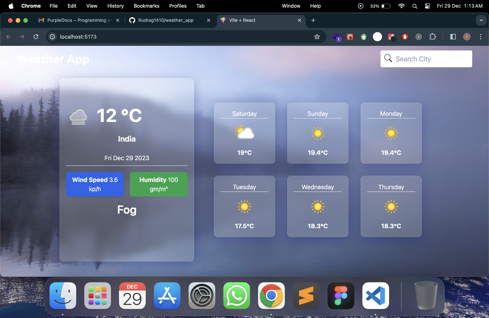

## This is Weather Forcasting app Made using React.js

## In this project i have used https://api.weatherapi.com/v1/forecast.json to get weather data and fetch it using axios

## For State Manangment i have use useContext hook

## For Styling i have use Taiwlind css

## Project Url => Git ::

[Visit Project on GitHub](https://github.com/Rudrag1410/weather_app/)

